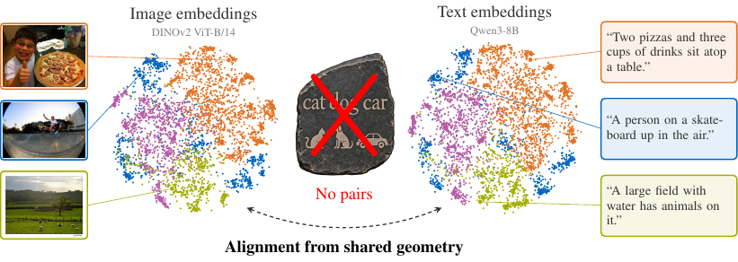

<div align="center">
<h1>Shared Geometry as a Rosetta Stone: Cross-Modal Alignment Without Paired Data</h1>

[**Dominik Schnaus**](https://dominik-schnaus.github.io/)<sup>1,2</sup>  [**Thomas Dagès**](https://tommoo.github.io/)<sup>1,2</sup>  [**Daniel Cremers**](https://cvg.cit.tum.de/members/cremers)<sup>1,2&dagger;</sup>  [**Xi Wang**](https://xiwang1212.github.io/homepage/)<sup>1,2,3,4&dagger;</sup>  [**Phillip Isola**](https://web.mit.edu/phillipi/)<sup>5&dagger;</sup>

<sup>1</sup>TU Munich  <sup>2</sup>MCML  <sup>3</sup>Ulm University  <sup>4</sup>ETH Zurich  <sup>5</sup>MIT  <sup>&dagger;</sup>Equal advising

<a href="https://dominik-schnaus.github.io/unpaired-rosetta/"></a>
<a href="https://arxiv.org/abs/2610.09411"></a>
<a href="https://colab.research.google.com/github/dominik-schnaus/unpaired-rosetta/blob/main/unpaired_rosetta.ipynb"></a>
[](https://pytorch.org/)

<center>
  
</center>
</div>

**TL;DR:** Image and text models trained separately share enough geometry that we can coarsely align their embeddings without a single paired example.

## Abstract

Multimodal representations enable zero-shot classification and retrieval, but aligning independently trained models usually requires large amounts of paired data. Yet, the Platonic Representation Hypothesis suggests that models trained on different modalities may converge spontaneously toward a shared representation geometry. But then, do we even need paired examples for cross-modal alignment? Remarkably, we show that **paired examples are unnecessary for coarse cross-modal alignment**. Our simple **Wasserstein Procrustes method with a coarse geometric initialization** aligns two disjoint embedding sets by estimating a single orthogonal map without seeing any pairs. Across datasets, modalities, and unimodal models, we show that we can **consistently align independently trained representations without pairs**, and standard geometric alignment metrics accurately predict when this is possible. Nevertheless, we can naturally benefit from paired examples. In the very few-pair regime, **our method substantially outperforms existing ones**, while staying competitive with pair-based methods with more added examples. Finally, we demonstrate that the resulting alignments can enable **text-to-image generation without paired examples**. These results show that independently trained models often share enough geometry to establish cross-modal correspondence with little or no paired data.

## Try it in the notebook

The fastest way to try the method is the notebook [`unpaired_rosetta.ipynb`](unpaired_rosetta.ipynb), which also runs on [Colab](https://colab.research.google.com/github/dominik-schnaus/unpaired-rosetta/blob/main/unpaired_rosetta.ipynb). It covers the following steps:

- **Setting:** you pick the datasets, the vision and language models, the number of known pairs and the seed from dropdowns, or you load your own embeddings.
- **Embeddings:** the notebook shows the size of the missing embeddings and asks before it downloads them from [Hugging Face](https://huggingface.co/datasets/schnaus/unpaired-rosetta-embeddings) or computes them.
- **Algorithm:** a short step-by-step implementation of Algorithms 1 and 2 aligns the two embedding sets.
- **Validation:** the notebook implements the validation of the paper on MS COCO and zero-shot classification.

## Environment setup

The code was tested with Python 3.14 and PyTorch 2.14. We use [pixi](https://pixi.sh) to install the environments.

1. Clone the repository with its submodules:
    ```sh
    git clone --recursive https://github.com/dominik-schnaus/unpaired-rosetta.git
    cd unpaired-rosetta
    ```

2. Install the default environment. It contains the method, all experiment scripts, the baselines and the tests:
    ```sh
    pixi install
    ```

3. (optional) Install the environments that some steps need:
    ```sh
    pixi install -e modalities    # computing the embeddings of the other modality pairs (Sec. 4.2)
    pixi install -e text2image    # text-to-image generation (Sec. 4.5)
    pixi install -e t2i-metrics   # scoring the generated images (Sec. 4.5)
    pixi install -e scale-rae     # the Scale-RAE comparison (Sec. 4.5)
    ```
    A few encoders need older package versions, so they have their own small environments, e.g., `vllm`, `mlip`, `msms`, `cellxgene` and `platonic-brain`. They are listed in `pyproject.toml` and are only needed to recompute those embeddings.

## Using the aligner

```python
from unpaired_rosetta import WassersteinProcrustes

aligner = WassersteinProcrustes()                               # C = 30, S = 30, b = 10,000, R = 100
aligner.fit(images, captions)                                   # two unpaired sets of embeddings
aligner.fit(images, captions, paired_images, paired_captions)   # optionally with a few known pairs
scores = aligner.similarity(val_images, val_captions)           # cosine similarity after the map
mapped = aligner.transform(val_images)                          # images mapped to the caption space
```

`WassersteinProcrustes(num_workers=8, num_threads=4)` solves the independent restarts and the assignments in parallel, and it gives exactly the same map as a sequential run.

## Reproducing the results

All experiments of the paper are in the folder `experiments`, with one script per experiment. Each script names the figures and tables it produces in its docstring.

### Configuring the paths and the cluster

All settings that depend on your machine are environment variables, which you can set in your shell profile. They are documented in `unpaired_rosetta/settings.py`, and none of them is required:

| Variable | Meaning | Default |
| --- | --- | --- |
| `UNPAIRED_ROSETTA_ROOT` | folder for embeddings, data, results and figures | `./storage` |
| `UNPAIRED_ROSETTA_RAW` | folder for raw downloads such as images and captions | `$UNPAIRED_ROSETTA_ROOT/raw` |
| `UNPAIRED_ROSETTA_SLURM_PARTITION` | SLURM partition of the submitted jobs | the cluster's default |
| `UNPAIRED_ROSETTA_SLURM_MAX_CPUS` | upper limit on the CPU cores per SLURM job | no limit |
| `UNPAIRED_ROSETTA_SLURM_EXCLUDE` | SLURM nodes to avoid, e.g. nodes with GPUs that the CUDA builds don't support | none |
| `ITSAMATCH_ROOT` | output folder of [itsamatch](https://github.com/dominik-schnaus/itsamatch), only for Fig. 7 | `$UNPAIRED_ROSETTA_ROOT/itsamatch` |
| `NSD_DATASET` | the NSD fMRI data, only for the brain benchmark of Sec. 4.2 | `$UNPAIRED_ROSETTA_ROOT/data/nsd` |

The root folder has the following subfolders:
```
$UNPAIRED_ROSETTA_ROOT/
  embeddings/   # embeddings of every dataset and model
  data/         # raw datasets
  results/      # one JSON file per run with the configuration, the metrics and the software versions
  figures/      # the figures and tables of the paper as PNG files, with the plotted numbers as CSV
  logs/         # SLURM logs
```
The code for downloading the data and computing the embeddings is in `modalities/<pair>/`, with one folder per modality pair. The embeddings of the vision-language experiments can also be downloaded from [Hugging Face](https://huggingface.co/datasets/schnaus/unpaired-rosetta-embeddings).

### Running an experiment

Every experiment script has two commands. `run` computes the results, and `plot` turns them into the figures and tables of the paper:
```sh
pixi run --frozen python -m experiments.unpaired run --workers 4 --threads 4   # all runs on this machine
pixi run --frozen python -m experiments.unpaired run --slurm --jobs 50         # or 50 SLURM jobs
pixi run --frozen python -m experiments.unpaired plot                          # the figures and tables
```
All experiment scripts run in the default environment. The text-to-image scripts start some steps in the other environments themselves, so those environments must be installed.

A run whose result already exists is skipped, so you can stop and restart a script. With `--slurm --jobs n`, the pending runs are split into n jobs. Each job runs on one node with 4 CPU cores and no GPU, except `text_to_image_scores`, which asks for one GPU. `--cpus` and `--gpus` change these numbers, and `--gpus 1` speeds up the baselines that train a network (vec2vec, SUE, STRUCTURE and SOTAlign), which otherwise run on the CPU. Without SLURM, `--shard i/n` runs only the i-th of n parts of the pending runs, so that several machines can share them. `--only` selects runs by their configuration, e.g. `--only "method == 'ours'"`, and `--dry-run` lists the pending runs. `python -m experiments.check_coverage` checks that every figure and table of the paper has a script and a PNG file.

The memory per job is set in each script. It is 96 GB for most vision-language experiments, and 64 GB or less for the others.

The commands below omit `pixi run --frozen`, and each experiment also has a `plot` command.

### Unpaired cross-modal alignment (Sec. 4.1)

We align 7 vision models and 3 language models on MS COCO, Stanford Paragraph Captioning, DCI and DOCCI without any pairs, and compare our method with vec2vec and mini-vec2vec. The experiments can be run with
```sh
python -m experiments.unpaired run
python -m experiments.cross_dataset run
python -m experiments.vision_language_examples run
```
They produce Fig. 3a, 3b and 9 to 12 (`unpaired`), Fig. 13 and the cross-dataset column of Fig. 3a (`cross_dataset`), where images and captions come from two different datasets, and the examples of Fig. 1 and 6a to 6c (`vision_language_examples`).

### Other domains (Sec. 4.2)

We align text encoders on Natural Questions, the two assays of single-cell data (PBMC), and the brain responses of different subjects (NSD), as well as 11 further modality pairs. The experiments can be run with
```sh
python -m experiments.domain_specific run
python -m experiments.other_domains run
python -m experiments.cyclegan_pairs run
```
They produce Fig. 4a and Tab. 8 to 10 (`domain_specific`, which also scores the brain baseline), Fig. 4b, Tab. 5 and Tab. 12 (`other_domains`), and Tab. 11 (`cyclegan_pairs`). The embeddings of these pairs are computed in the `modalities` environment, as described in `modalities/<pair>/README.md`.

### Shared geometry predicts alignment (Sec. 4.3)

We compute CKA, mutual k-NN, TSI and QSI between every pair of models and compare them with the alignment quality. The experiment can be run with
```sh
python -m experiments.shared_geometry run
```
It produces Fig. 3c and 14.

### Few-pair alignment (Sec. 4.4)

We compare our method with 0 to 1000 known pairs against linear, orthogonal, ASIF, LocalCKA, SUE, STRUCTURE and SOTAlign. The experiment can be run with
```sh
python -m experiments.few_pair run
```
It produces Fig. 5.

### Text-to-image generation (Sec. 4.5)

We map captions into the latent space of an RAE diffusion model with our alignment, and we score the generated images with CLIPScore, VQAScore, TIFA and CycleReward. The experiments need the `text2image`, `t2i-metrics` and `scale-rae` environments, and they can be run with
```sh
python -m experiments.text_to_image run
python -m experiments.text_to_image_scores run
```
They produce Fig. 6d and 15 to 18 (`text_to_image`), and Tab. 6 and 7 (`text_to_image_scores`). The `plot` command of `text_to_image` also samples the grid images on a GPU, and the scoring needs a GPU with at least 24 GB.

### Ablations of the aligner (Appendix)

These experiments evaluate the design choices of our aligner. They can be run with
```sh
python -m experiments.ablation_initialization run   # Tab. 1
python -m experiments.lowrank_gw run                # Tab. 2
python -m experiments.ablation_readout run          # Tab. 3
python -m experiments.ablation_refinement run       # Tab. 4
python -m experiments.qap_solvers run               # Fig. 7
python -m experiments.ablation_hyperparameters run  # Fig. 8
```
Fig. 7 runs only our MPOpt solver. The other solvers in it are the published runs of [Schnaus et al. (2025)](https://github.com/dominik-schnaus/itsamatch), made with their official code.

### Further analyses (Appendix)

These experiments can be run with
```sh
python -m experiments.qualitative run     # Fig. 19
python -m experiments.token_pooling run   # Fig. 20 and 21
python -m experiments.granularity run     # Fig. 22 to 24
```

## Tests

The tests check the evaluation and the equivalence of the notebook and the library, which give the same map for the same seed. They also compare every baseline and metric with its official code, which `tests/<name>/clone.sh` downloads at a fixed commit:
```sh
pixi run --frozen pytest tests
```

## Citation

If you find our work helpful, please consider citing the following paper and ⭐ the repo.

```
@article{schnaus2026shared,
  title={Shared Geometry as a Rosetta Stone: Cross-Modal Alignment Without Paired Data},
  author={Schnaus, Dominik and Dag{\`e}s, Thomas and Cremers, Daniel and Wang, Xi and Isola, Phillip},
  journal={arXiv preprint arXiv:2610.09411},
  year={2026}
}
```
